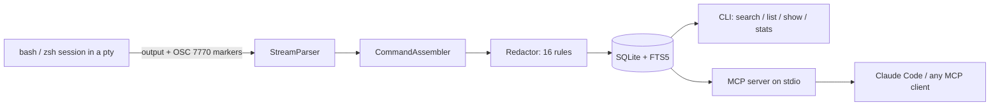

# termtape

[English](README.md) | [中文](README.zh.md) | [日本語](README.ja.md)

[](LICENSE) [](CHANGELOG.md) [](package.json) [](test/)

**オープンソースかつ local-first なターミナルのフライトレコーダー。コマンドと出力を丸ごと記録し、全文検索と MCP で coding agent の記憶になります。**


```bash
# Not on npm yet — build from source (see Quickstart):
cd termtape && npm install && npm run build && npm install -g .
```

## なぜ termtape なのか

shell の履歴が覚えているのは「何を打ったか」だけで、「何が起きたか」ではありません。atuin で最も要望の多い機能であるコマンド出力の記録は、2024 年から未解決の issue のままです（atuin#2179）。asciinema は再生用の録画であり、構造化されたクエリはできません。`script(1)` は生バイトを書き出すだけで、インデックスも redaction もありません。一方で、coding agent に渡して最も役立つ情報は「昨日のあのエラー」であることが多いのに、それを覚えている仕組みはマシン上のどこにもありません。

termtape は pty レイヤーで各コマンドと**その完全な出力**を記録し、作業ディレクトリと git のコンテキストを付与し、ディスクに書き込む前にシークレットを除去した上で、内蔵の MCP server を通じて履歴全体を coding agent に公開します。

|  | termtape | atuin | asciinema |
|---|---|---|---|
| コマンドの完全な出力を記録 | yes | no (commands only) | yes (as a cast recording) |
| コマンド単位の構造化レコード（cwd・git・終了コード） | yes | yes (no output) | no |
| 出力に対する全文検索 | yes (SQLite FTS5) | no | no |
| 保存前の自動 redaction | yes (16 rules) | no | no |
| coding agent 向け内蔵 MCP server | yes | no | no |

## 特徴

- **すべてを記録** — 各コマンドと完全な出力を pty レイヤーで捕捉し、レコードごとに cwd・git ブランチ/コミット・終了コード・所要時間を付与します。
- **コマンドだけでなく出力を検索** — SQLite FTS5 と bm25 ランキングに対応。ディレクトリ・git ブランチ・失敗のみ・終了コード・時間窓（`--since 2h`）で絞り込めます。
- **シークレットはディスクに残さない** — 16 種類の redaction ルール（AWS・GitHub・Slack・Anthropic・OpenAI キー、JWT、PEM ブロック、URL 内の資格情報、`SECRET=` 代入など）が保存前にストリームから除去します。カスタムルールも設定できます。
- **coding agent の記憶に** — 内蔵の読み取り専用 MCP server により、Claude Code や任意の MCP client が「昨日のあのエラーは何だったか」に実履歴から答えられます。
- **読みやすい記録** — ANSI エスケープを取り除き、`\r`/`\b` の上書きを適用するため、プログレスバーは最終状態に畳まれ、検索を汚しません。
- **ストレージ層はネイティブ依存ゼロ** — Node >= 22.13 同梱の `node:sqlite` 上に構築。`node-pty` はオプションで、無い場合はパイプ方式にフォールバックします。
- **デフォルトでプライベート** — データは `~/.local/share/termtape/` 配下のパーミッション `0600` の SQLite ファイルに保存され、テレメトリーはなく、実行時にネットワークへアクセスしません。

## クイックスタート

Node.js >= 22.13 が必要です。

1. インストール。termtape はまだ npm に公開されていません。リポジトリを clone してソースからビルドしてインストールします:

```bash
git clone https://github.com/JaydenCJ/termtape.git
cd termtape
npm install && npm run build && npm install -g .
```

> **最初の release 以降:** v0.1.0 が npm registry に公開されると、`npm install -g termtape` の 1 行でインストールできるようになります。それまでは registry のコマンドは失敗するため、上記のソースビルドを使ってください。

2. 記録します。`termtape record` で shell 全体をラップするか、`--` の後に単発のコマンドを指定します:

```bash
termtape record -- curl -sS http://127.0.0.1:5432/health
```

```text
curl: (7) Failed to connect to 127.0.0.1 port 5432 after 0 ms: Couldn't connect to server

termtape: recorded 1 command(s) → /root/.local/share/termtape/termtape.db
```

3. 後から検索します。インデックスされるのはコマンドラインだけでなく出力です:

```bash
termtape search "port 5432"
```

```text
    #1  2026-07-08 04:51:32  [7]  curl -sS http://127.0.0.1:5432/health
        /home/user/termtape (main)
        curl: (7) Failed to connect to 127.0.0.1 >>port<< >>5432<< after 0 ms: Couldn …
```

4. `termtape show 1` でレコード全体を確認できます。coding agent との接続は次のセクションを参照してください。

## coding agent との連携（MCP）

`termtape mcp` は stdio 上で読み取り専用の MCP server を起動し、`search_terminal_history`・`get_command_output`・`list_recent_commands`・`list_sessions` の 4 つの tool を提供します。Claude Code の場合は、プロジェクトの `.mcp.json` に次のスニペットを貼り付けてください:

```json
{
  "mcpServers": {
    "termtape": {
      "command": "termtape",
      "args": ["mcp"]
    }
  }
}
```

stdio に対応した MCP client であれば、`termtape mcp` を server コマンドとして起動するだけで同じように使えます。agent は記録された履歴を検索して「昨日 migration を実行したときの正確なエラーは何か」といった質問に答えられます。データベース内の出力は記録時点で redaction 済みです。

## 設定

設定ファイルは `~/.config/termtape/config.json` に置きます（すべてのフィールドは省略可能です）:

```json
{
  "maxOutputBytes": 2097152,
  "redact": {
    "enabled": true,
    "disable": [],
    "custom": [
      { "id": "internal-token", "pattern": "corp_[A-Za-z0-9]{32}" }
    ]
  },
  "ignoreCommands": ["^vault ", "--password"]
}
```

- `maxOutputBytes` — コマンドごとの保存上限です。超過した場合は先頭と末尾を残して中間を切り詰めます。
- `redact.disable` / `redact.custom` — 組み込みルールを id で無効化（`termtape redact --list` で一覧表示）するか、独自の正規表現ルールを追加します。
- `ignoreCommands` — 正規表現のリストです。一致したコマンドは一切記録されません。

環境変数: `TERMTAPE_DB`（データベースパス）、`TERMTAPE_CONFIG`（設定ファイルパス）。

## アーキテクチャ



shell hook は一時的な rc ファイル経由で注入され、dotfiles を書き換えることはありません。各コマンドの前後にプライベートな OSC 7770 エスケープマーカーを発行します。レコーダーは表示内容からマーカーを取り除き、生の pty バイトストリームをコマンド単位のレコードに分割し、最終的なターミナルテキストを再構成して、redaction 後に external-content FTS5 インデックス付きの SQLite へ書き込みます。

## ロードマップ

- [x] bash / zsh の記録、FTS5 検索、シークレット redaction、内蔵 MCP server
- [ ] fish shell hook
- [ ] atuin 履歴からのインポートと atuin プラグインモード
- [ ] データベースの保存時暗号化
- [ ] `termtape ui` — インタラクティブな TUI ブラウザー
- [ ] シングルバイナリ移植による Node 不要のインストール

最初の release 後に独立リポジトリへ移行するまで、ロードマップはこの一覧で管理します。

## コントリビューション

コントリビューションを歓迎します。[CONTRIBUTING.md](CONTRIBUTING.md) をご覧ください。issue tracker と Discussions は、最初の release 後の独立リポジトリと同時に開設します。

## ライセンス

[MIT](LICENSE)
