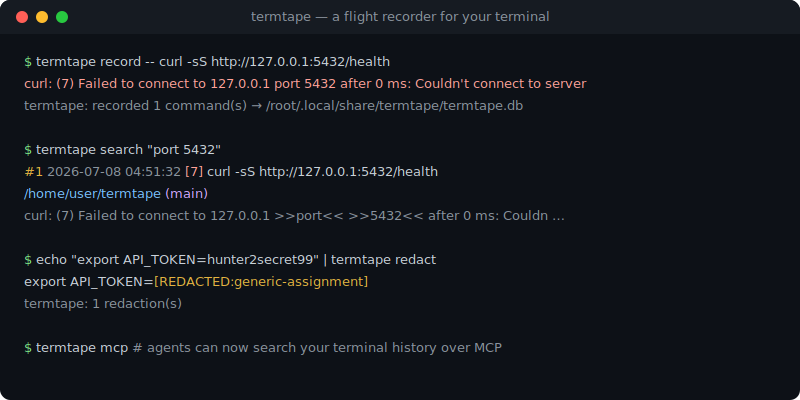
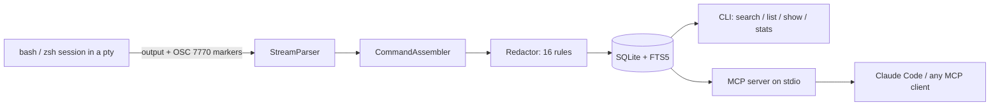

# termtape

[English](README.md) | [中文](README.zh.md) | [日本語](README.ja.md)

[](LICENSE) [](CHANGELOG.md) [](package.json) [](test/)

**An open-source, local-first flight recorder for your terminal — full command output, searchable, agent-ready via MCP.**



```bash
# Not on npm yet — build from source (see Quickstart):
cd termtape && npm install && npm run build && npm install -g .
```

## Why termtape?

Your shell history remembers what you typed — not what happened. atuin's most-requested feature, recording command output, has been an open issue since 2024 (atuin#2179). asciinema records a replayable cast you cannot query, and `script(1)` dumps raw bytes with no index and no redaction. Meanwhile, the most useful thing you can feed a coding agent is often "that error from yesterday" — which nothing on your machine actually remembers.

termtape records every command **plus its complete output** at the pty layer, attaches working-directory and git context, scrubs secrets before anything touches disk, and exposes the whole history to coding agents through a built-in MCP server.

|  | termtape | atuin | asciinema |
|---|---|---|---|
| Records full command output | yes | no (commands only) | yes (as a cast recording) |
| Structured per-command records (cwd, git, exit code) | yes | yes (no output) | no |
| Full-text search across outputs | yes (SQLite FTS5) | no | no |
| Automatic secret redaction before storage | yes (16 rules) | no | no |
| Built-in MCP server for coding agents | yes | no | no |

## Features

- **Total recall** — every command and its complete output is captured at the pty layer, with cwd, git branch/commit, exit code and duration attached to each record.
- **Search the output, not just the command** — SQLite FTS5 with bm25 ranking; filter by directory, git branch, failures only, exit code or time window (`--since 2h`).
- **Secrets never reach disk** — 16 redaction rules (AWS, GitHub, Slack, Anthropic, OpenAI keys, JWTs, PEM blocks, URL credentials, `SECRET=` assignments, ...) scrub the stream before storage; custom rules via config.
- **Memory for coding agents** — a built-in read-only MCP server lets Claude Code or any MCP client answer "what was that error yesterday?" from your real history.
- **Readable transcripts** — ANSI escapes are stripped and `\r`/`\b` overwrites applied, so progress bars collapse to their final state instead of polluting search.
- **No native storage dependency** — built on `node:sqlite` (bundled with Node >= 22.13); `node-pty` is optional, with a pipe fallback.
- **Private by default** — a `0600` SQLite file under `~/.local/share/termtape/`, no telemetry, no network access at runtime.

## Quickstart

Requires Node.js >= 22.13.

1. Install. termtape is not published to npm yet. Clone the repository, then build and install it from source:

```bash
git clone https://github.com/JaydenCJ/termtape.git
cd termtape
npm install && npm run build && npm install -g .
```

> **After the first release:** once v0.1.0 is published to the npm registry, `npm install -g termtape` becomes the one-line install. Until then the registry command fails — use the source build above.

2. Record — wrap your whole shell in `termtape record`, or record a single command after `--`:

```bash
termtape record -- curl -sS http://127.0.0.1:5432/health
```

```text
curl: (7) Failed to connect to 127.0.0.1 port 5432 after 0 ms: Couldn't connect to server

termtape: recorded 1 command(s) → /root/.local/share/termtape/termtape.db
```

3. Search it later — the output is indexed, not just the command line:

```bash
termtape search "port 5432"
```

```text
    #1  2026-07-08 04:51:32  [7]  curl -sS http://127.0.0.1:5432/health
        /home/user/termtape (main)
        curl: (7) Failed to connect to 127.0.0.1 >>port<< >>5432<< after 0 ms: Couldn …
```

4. Inspect the full record with `termtape show 1`, or connect your coding agent (next section).

## Using with coding agents (MCP)

`termtape mcp` runs a read-only MCP server on stdio with four tools: `search_terminal_history`, `get_command_output`, `list_recent_commands` and `list_sessions`. For Claude Code, paste this into your project's `.mcp.json`:

```json
{
  "mcpServers": {
    "termtape": {
      "command": "termtape",
      "args": ["mcp"]
    }
  }
}
```

Any MCP client that speaks stdio works the same way: run `termtape mcp` as the server command. The agent can then answer questions like "what was the exact error when I ran the migration yesterday?" by searching your recorded history — output stored in the database was already redacted at record time.

## Configuration

Optional config file at `~/.config/termtape/config.json` (all fields optional):

```json
{
  "maxOutputBytes": 2097152,
  "redact": {
    "enabled": true,
    "disable": [],
    "custom": [
      { "id": "internal-token", "pattern": "corp_[A-Za-z0-9]{32}" }
    ]
  },
  "ignoreCommands": ["^vault ", "--password"]
}
```

- `maxOutputBytes` — per-command storage cap; when exceeded, head and tail are kept and the middle is truncated.
- `redact.disable` / `redact.custom` — turn off built-in rules by id (`termtape redact --list`) or add your own regex rules.
- `ignoreCommands` — regexes; matching commands are not recorded at all.

Environment variables: `TERMTAPE_DB` (database path), `TERMTAPE_CONFIG` (config path).

## Architecture



Shell hooks (injected via a temporary rc file — your dotfiles are never modified) emit private OSC 7770 escape markers around every command. The recorder strips the markers from what you see, segments the raw pty stream into per-command records, reconstructs the final terminal text, redacts secrets and writes to SQLite with an external-content FTS5 index.

## Roadmap

- [x] bash & zsh recording, FTS5 search, secret redaction, built-in MCP server
- [ ] fish shell hooks
- [ ] Import from atuin history, and an atuin plugin mode
- [ ] Encryption at rest for the database
- [ ] `termtape ui` — interactive TUI browser
- [ ] Single-binary port for zero-Node installs

The roadmap is tracked in this list until the project moves to a standalone repository after the first release.

## Contributing

Contributions are welcome — see [CONTRIBUTING.md](CONTRIBUTING.md). The issue tracker and Discussions open together with the standalone repository after the first release.

## License

[MIT](LICENSE)
