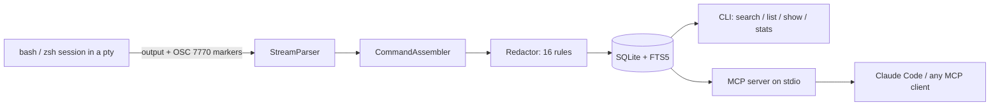

# termtape

[English](README.md) | [中文](README.zh.md) | [日本語](README.ja.md)

[](LICENSE) [](CHANGELOG.md) [](package.json) [](test/)

**开源、local-first 的终端「黑匣子」——完整记录每条命令的全部输出，可全文搜索，并通过 MCP 直接成为 coding agent 的记忆。**


```bash
# Not on npm yet — build from source (see Quickstart):
cd termtape && npm install && npm run build && npm install -g .
```

## 为什么是 termtape？

shell 历史记住的只是你敲了什么，而不是发生了什么。atuin 呼声最高的功能——记录命令输出——自 2024 年起一直是未关闭的 issue（atuin#2179）；asciinema 录的是可回放的录像，无法结构化查询；`script(1)` 只会倾倒原始字节，既没有索引也没有脱敏。与此同时，喂给 coding agent 最有用的信息往往是「昨天那个报错」——而你的机器上没有任何东西真正记得它。

termtape 在 pty 层记录每条命令**及其完整输出**，附带工作目录与 git 上下文，在数据落盘之前先擦除密钥，并通过内置 MCP server 把整份历史暴露给 coding agent。

|  | termtape | atuin | asciinema |
|---|---|---|---|
| 记录命令的完整输出 | yes | no (commands only) | yes (as a cast recording) |
| 结构化的单命令记录（cwd、git、退出码） | yes | yes (no output) | no |
| 跨输出的全文搜索 | yes (SQLite FTS5) | no | no |
| 存储前自动脱敏 | yes (16 rules) | no | no |
| 面向 coding agent 的内置 MCP server | yes | no | no |

## 特性

- **全量回忆** —— 每条命令及其完整输出都在 pty 层捕获，每条记录附带 cwd、git 分支/提交、退出码与耗时。
- **搜的是输出，不只是命令** —— SQLite FTS5 + bm25 排序；可按目录、git 分支、仅失败、退出码或时间窗（`--since 2h`）过滤。
- **密钥永不落盘** —— 16 条脱敏规则（AWS、GitHub、Slack、Anthropic、OpenAI 密钥、JWT、PEM 块、URL 凭据、`SECRET=` 赋值等）在写入前擦除数据流；支持自定义规则。
- **coding agent 的记忆** —— 内置只读 MCP server，让 Claude Code 或任何 MCP client 用你的真实历史回答「昨天那个报错是什么？」。
- **可读的记录** —— 剥离 ANSI 转义并应用 `\r`/`\b` 覆写，进度条会折叠为最终状态，不污染搜索。
- **存储层零原生依赖** —— 基于 `node:sqlite`（Node >= 22.13 内置）；`node-pty` 为可选依赖，缺失时回退到管道模式。
- **默认私有** —— 数据存放在 `~/.local/share/termtape/` 下权限 `0600` 的 SQLite 文件里，无遥测，运行时不访问网络。

## 快速开始

需要 Node.js >= 22.13。

1. 安装。termtape 尚未发布到 npm。请 clone 仓库后从源码构建安装：

```bash
git clone https://github.com/JaydenCJ/termtape.git
cd termtape
npm install && npm run build && npm install -g .
```

> **首个 release 之后：** v0.1.0 发布到 npm registry 后，`npm install -g termtape` 即成为一行安装命令。在此之前该命令会失败——请使用上面的源码构建方式。

2. 录制——用 `termtape record` 包住整个 shell，或在 `--` 之后录制单条命令：

```bash
termtape record -- curl -sS http://127.0.0.1:5432/health
```

```text
curl: (7) Failed to connect to 127.0.0.1 port 5432 after 0 ms: Couldn't connect to server

termtape: recorded 1 command(s) → /root/.local/share/termtape/termtape.db
```

3. 事后搜索——索引的是输出，而不只是命令行：

```bash
termtape search "port 5432"
```

```text
    #1  2026-07-08 04:51:32  [7]  curl -sS http://127.0.0.1:5432/health
        /home/user/termtape (main)
        curl: (7) Failed to connect to 127.0.0.1 >>port<< >>5432<< after 0 ms: Couldn …
```

4. 用 `termtape show 1` 查看完整记录，或接入你的 coding agent（见下一节）。

## 与 coding agent 搭配（MCP）

`termtape mcp` 在 stdio 上运行一个只读 MCP server，提供四个 tool：`search_terminal_history`、`get_command_output`、`list_recent_commands` 与 `list_sessions`。Claude Code 用户把下面的片段粘贴进项目的 `.mcp.json` 即可：

```json
{
  "mcpServers": {
    "termtape": {
      "command": "termtape",
      "args": ["mcp"]
    }
  }
}
```

任何支持 stdio 的 MCP client 都以同样方式接入：把 `termtape mcp` 作为 server 命令运行。此后 agent 就能通过搜索你的记录历史回答「我昨天跑迁移时的确切报错是什么？」这类问题——数据库中的输出在录制时就已完成脱敏。

## 配置

可选配置文件位于 `~/.config/termtape/config.json`（所有字段均可省略）：

```json
{
  "maxOutputBytes": 2097152,
  "redact": {
    "enabled": true,
    "disable": [],
    "custom": [
      { "id": "internal-token", "pattern": "corp_[A-Za-z0-9]{32}" }
    ]
  },
  "ignoreCommands": ["^vault ", "--password"]
}
```

- `maxOutputBytes` —— 单命令存储上限；超出时保留首尾、截断中间。
- `redact.disable` / `redact.custom` —— 按 id 关闭内置规则（`termtape redact --list` 查看），或添加自定义正则规则。
- `ignoreCommands` —— 正则列表；命中的命令完全不记录。

环境变量：`TERMTAPE_DB`（数据库路径）、`TERMTAPE_CONFIG`（配置路径）。

## 架构



shell hook（通过临时 rc 文件注入——绝不修改你的 dotfiles）在每条命令前后发出私有 OSC 7770 转义标记。录制器会从你看到的内容中剥离这些标记，把原始 pty 字节流切分成单命令记录，重建最终的终端文本，完成脱敏后写入带 external-content FTS5 索引的 SQLite。

## 路线图

- [x] bash 与 zsh 录制、FTS5 搜索、密钥脱敏、内置 MCP server
- [ ] fish shell hook
- [ ] 从 atuin 历史导入，以及 atuin 插件模式
- [ ] 数据库静态加密
- [ ] `termtape ui` —— 交互式 TUI 浏览器
- [ ] 单二进制移植，实现零 Node 安装

首个 release 后项目迁移到独立仓库前，路线图以本清单为准。

## 参与贡献

欢迎贡献——参见 [CONTRIBUTING.md](CONTRIBUTING.md)。issue tracker 与 Discussions 将随首个 release 后的独立仓库一同开放。

## 许可证

[MIT](LICENSE)
